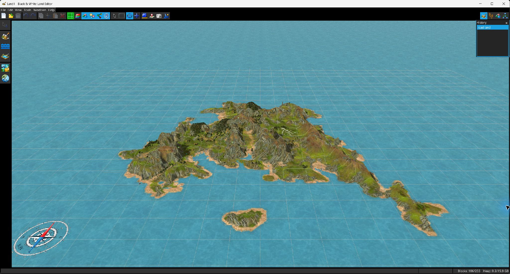

# Black & White Land Editor

**BWLandEditorGUI** is a graphical editor for creating and modifying landscapes and related LHX data for *Black & White*.

It provides a 3D editing environment for terrain sculpting, materials and countries, water, environmental sounds, object placement, LHX scripting, import/export operations, and project recovery.

## Features

- **Interactive 3D landscape editing**
  - Orbit, pan and top/orthographic views
  - Grid, cell attributes, objects, links and compass overlays
  - Free selection and terrain movement tools

- **Terrain sculpting**
  - Absolute and relative sculpting
  - Flatten, smooth and terrace modes
  - Configurable brush shape, size, flow, smoothness and rotation
  - Cliff and coastline configuration

- **Landscape painting**
  - Country painting
  - Environmental sound painting
  - Ocean and lake tools
  - Slope and altitude filters

- **Materials and countries**
  - Material editor
  - Country editor and material mixer
  - Import, export, duplication and replacement
  - Noise map and coastline bump map editing
  - Terrain shadow updates

- **Import and export**
  - Open and save `.lnd` landscapes
  - Open and save LHX `.txt` scripts
  - Import parts of another landscape
  - Import PNG height maps
  - Export height maps
  - Capture screenshots of the 3D viewport

- **Object placement**
  - Object catalog with drag-and-drop placement
  - Select, move, copy, cut, paste and delete objects
  - Edit object attributes and hierarchy
  - Work with towns, flocks, forests and related LHX objects

- **LHX editing**
  - Script editor
  - Tree view
  - Search and navigation
  - Command completion
  - Land and gameplay attributes

- **Utility tools**
  - Random landscape generator
  - Block inspector
  - Edit history
  - Console output
  - Camera information
  - Model viewer
  - Autosave and automatic recovery

- **Multiple languages**
  - English
  - Italian
  - French
  - German
  - Spanish

## Documentation

The complete user guide is available in the [`docs`](docs/index.htm) directory and includes screenshots and descriptions of the editor tools.

Documentation is available in:

- [English](docs/index.htm)
- [Italiano](docs/it/index.htm)
- [Français](docs/fr/index.htm)
- [Deutsch](docs/de/index.htm)
- [Español](docs/es/index.htm)

The `docs` directory can also be used as the source directory for GitHub Pages.

## Getting started

1. Start the editor.
2. Create a new project or open an existing `.lnd` landscape or LHX `.txt` script.
3. Configure the *Black & White* game directory in **Preferences** when access to game resources such as the object catalog is required.
4. Edit the landscape, place objects and modify the LHX script as needed.
5. Save the landscape and script from the **File** menu.

For detailed instructions, see the [user guide](docs/index.htm).

## Main editing workflow

A typical workflow is:

1. Define or import materials and countries.
2. Sculpt the terrain.
3. Create oceans and lakes.
4. Paint countries and environmental sounds.
5. Place and configure LHX objects.
6. Edit the LHX initialization script and land attributes.
7. Save the landscape and script.

## Technology

BWLandEditorGUI is written in **Java** and uses **LibGDX** for its graphical interface and 3D rendering.

## License

Copyright © 2024–2026 **Daniele Lombardi / Daniels118**.

This project is free software distributed under the **GNU General Public License, version 3 or, at your option, any later version**.

See the repository license file for the complete license text.

